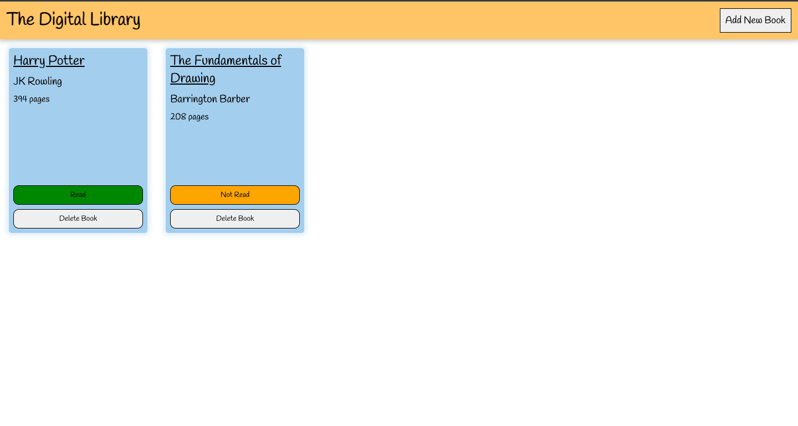

# The Odin Project Web Development Curriculum
## Project: Library

### Live Site: https://kizitojoel.github.io/library/
### Stage 1 | Factory Functions
Implemented the library website and javascript functionality using factory functions.

**Concepts I learned:**
- How to implement modal elements in my html
- Using factory functions and the benefits of keeping my global scope free
- Importing fonts using Google Fonts
- Implementing appearance of transitions using transform in CSS:
```CSS
.active
{
    transform: translate(-50%, -50%) scale(1);
    transition: ease-in-out 0.2s;
}
```
- Adding data attributes to HTML elements for ease of access in my Javascript



### Stage 2 | Classes
Retained the functional and styling properties of my website. The main shift was changing the factory functions and implementing classes in their stead. I implemented Library and Book Classes for the website

**Concepts I learned:**
- Writing markdown for my documentation
- Implementing large changes using Git branching. The process for branching is as follows:
1. Create a new branch: `git branch <branch-name>`
2. Move into the new branch name: `git checkout <branch-name>`
3. Push the new branch into the remote repo: `git push origin <branch-name>`
4. Work on changes and push using `git push origin <branch-name>`
5. To merge the changes with main branch:
```Git
git checkout main
git merge <branch-name>
git push origin main
```
- Implementing classes
- Difference between static methods and instance methods